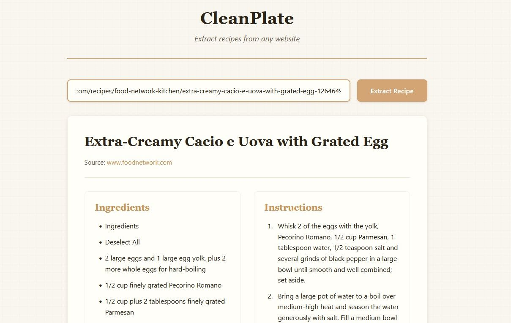

# CleanPlate

  

*Because copying recipes from blogs with 17 popups and a life story is like peeling an onion while being interviewed about your childhood.*



## About

The **pain**: You found the perfect recipe online. Now you have to scroll past ads, video players, SEO keyword salad, and someone's memoir about their grandmother just to find out if you need eggs.

The **solution**: CleanPlate extracts the actual recipe—ingredients and instructions—from any website in seconds. No ads, no stories, no nonsense. Just the food.

**Repository**: [https://github.com/AdamMoses-GitHub/CleanPlate](https://github.com/AdamMoses-GitHub/CleanPlate)

---

## What It Does

### The Main Features
- **Extract recipes from any URL**: Paste a link, get a clean recipe
- **Two-phase "Waterfall" extraction**: Tries structured data first, falls back to smart DOM scraping
- **Works on protected sites**: Built-in bot-detection evasion gets past most blocks
- **Clean, readable interface**: "Warm paper" aesthetic—like a cookbook, not a dashboard
- **Instant results**: No loading spinners that make you question reality
- **Actionable error messages**: When it fails, it tells you why and what to try next

### The Nerdy Stuff
- **JSON-LD structured data parsing** (Phase 1) with 95%+ accuracy on modern recipe sites
- **Heuristic DOM fallback** (Phase 2) for legacy/non-compliant sites
- **Anti-bot measures**: User-agent rotation, HTTP/2, cookie persistence, referer spoofing
- **SSRF protection**: Blocks internal/private IP ranges
- **Session-based rate limiting**: 10 requests/minute, 2-second per-domain delays
- **Zero external dependencies**: Pure PHP + vanilla JavaScript

---

## Quick Start (TL;DR)

**Full instructions**: See [INSTALL_AND_USAGE.md](INSTALL_AND_USAGE.md)

```bash
# Clone the repo
git clone https://github.com/AdamMoses-GitHub/CleanPlate.git
cd CleanPlate

# Run system check (optional but recommended)
php -S localhost:8080
# Open: http://localhost:8080/system-check.php

# Launch the app
# Open: http://localhost:8080/public/index.html
# Paste a recipe URL, click Extract
```

---

## Tech Stack

| Component | Purpose | Why This One |
|-----------|---------|--------------|
| **PHP 7.4+** | Backend parser & API | Native DOM/cURL support, fast on shared hosting |
| **DOMDocument/XPath** | Phase 2 DOM scraping | Built-in, no dependencies, handles malformed HTML |
| **cURL** | HTTP fetching with evasion | Advanced header control, cookie persistence, HTTP/2 |
| **Vanilla JavaScript** | Frontend state management | 0 dependencies, <10KB, works everywhere |
| **CSS Grid/Flexbox** | Responsive layout | Modern, no Bootstrap bloat |

---

## Project Structure

```
cleanplate/
├── parser.php                 # JSON API endpoint (rate limiting, SSRF protection)
├── system-check.php           # Diagnostic tool (verify PHP extensions, permissions)
├── test-scraper.php           # Test harness for recipe extraction
├── includes/
│   └── RecipeParser.php       # Core extraction logic (2-phase waterfall)
└── public/
    ├── index.html             # Main UI
    ├── css/
    │   └── style.css          # Warm paper aesthetic (serif headings, sans body)
    └── js/
        └── app.js             # Client-side state management & API calls
```

---

## License

MIT License. See [LICENSE](LICENSE) for details.

## Contributing

PRs welcome. Keep it simple, keep it fast, keep it dependency-free.

---

<sub>recipe scraper, recipe parser, web scraping, PHP recipe extractor, JSON-LD parser, DOM scraping, anti-bot evasion, recipe extraction API, cloudflare bypass, structured data scraping, recipe card generator, food blog parser, cooking app, ingredient extractor, instruction parser, PHP web scraper, clean recipe interface, recipe converter, food site scraper, recipe aggregator</sub>
  "suggestions": [
    "Make sure the URL points to a recipe page",
    "Try clicking 'Jump to Recipe' and using that URL"
  ],
  "timestamp": "2026-02-04T10:30:00Z"
}
```

## Security Features

- URL validation and SSRF protection
- Rate limiting (session-based)
- User-Agent spoofing to mimic browser requests
- Protected includes directory
- Input sanitization and output escaping
- 30-second execution timeout

## Bot-Detection Evasion

CleanPlate implements multiple layers of bot-detection evasion to successfully scrape from sites like Food Network, AllRecipes, and other heavily protected recipe sites:

### 1. User-Agent Rotation
- Pool of 5 realistic browser user-agents (Chrome, Firefox, Safari on various platforms)
- Consistent user-agent per session to avoid mid-session detection
- Stored in `$_SESSION['user_agent']` for consistency

### 2. Browser-Like HTTP Headers
- Complete header set mimicking real browsers:
  - `Accept`: Full content type negotiation
  - `Accept-Language`: English preferences
  - `Accept-Encoding`: gzip, deflate, br (Brotli)
  - `DNT`: Do Not Track header
  - `Connection`: keep-alive
  - `Upgrade-Insecure-Requests`: HTTPS preference indicator
  - `Sec-Fetch-*`: Browser fetch metadata (Dest, Mode, Site, User)
  - `Referer`: Simulates organic traffic from Google

### 3. Cookie Persistence
- Session-specific cookie files stored in system temp directory
- Format: `cleanplate_cookie_{session_id}.txt`
- Enables multi-request sessions with consistent state
- Bypasses cookie-based bot detection

### 4. Per-Domain Request Delays
- Minimum 2-second delay between consecutive requests to same domain
- Tracked in `$_SESSION['domain_requests']` by hostname
- Prevents aggressive scraping detection patterns
- Does not affect user experience (only delays concurrent requests to same site)

### 5. HTTP/2 Support
- Uses `CURL_HTTP_VERSION_2_0` for modern protocol support
- More authentic browser fingerprint

### 6. Advanced Error Detection
- Detects Cloudflare challenges (`cf-browser-verification`)
- Identifies JavaScript-required pages
- Returns specific error codes: `CLOUDFLARE_BLOCK`, `JAVASCRIPT_REQUIRED`, `ACCESS_DENIED`
- Provides actionable user suggestions for each error type

### Configuration Constants
You can adjust behavior in [RecipeParser.php](includes/RecipeParser.php):
- `MIN_REQUEST_DELAY`: Seconds between requests to same domain (default: 2)
- `MAX_REDIRECTS`: Maximum redirect hops (default: 5)
- `REQUEST_TIMEOUT`: cURL timeout in seconds (default: 10)

### Testing Enhanced Scraping
Use the included test script:
```bash
php test-scraper.php
# Or test a specific URL:
php test-scraper.php "https://www.foodnetwork.com/recipes/..."
```

The test script will show:
- Extraction success/failure
- Phase used (1=JSON-LD, 2=DOM)
- Browser user-agent selected
- Ingredient/instruction counts
- Error categorization if extraction fails

## Browser Support

- Chrome/Edge (latest)
- Firefox (latest)
- Safari (latest)
- Modern mobile browsers

## Requirements

- PHP 7.4 or higher
- PHP extensions: `curl`, `dom`, `json`, `mbstring`
- Apache with mod_rewrite (or equivalent for other servers)
- Modern web browser with JavaScript enabled

## Development

To modify the extraction logic:
- Phase 1 logic: Edit `includes/RecipeParser.php` → `extractFromJsonLd()`
- Phase 2 logic: Edit `includes/RecipeParser.php` → `extractFromDom()`
- API handling: Edit `parser.php`
- Frontend: Edit `public/js/app.js` and `public/css/style.css`

## License

MIT License - Feel free to use and modify as needed.

## Credits

Created as part of the CleanPlate project (2026)
